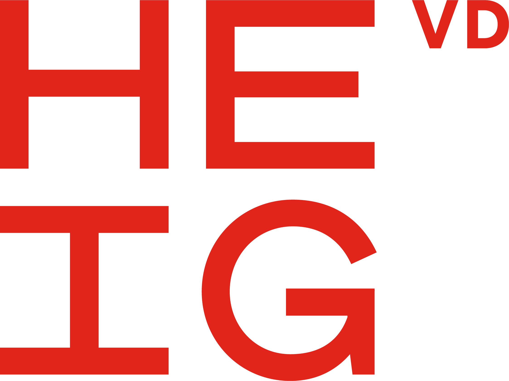
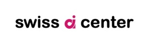
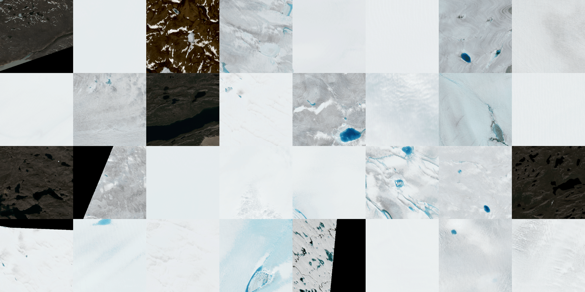
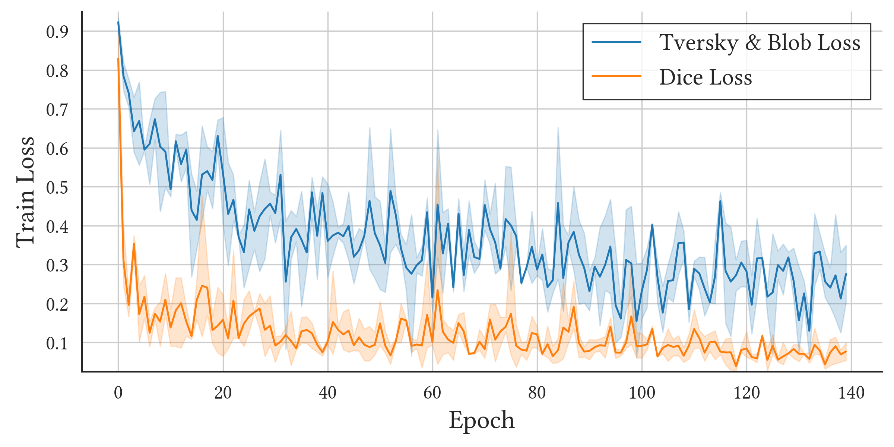

<h1>GISCUP 2023 ResNet-UNET</h1>

- [Introduction](#introduction)
  - [Authors](#authors)
  - [Who We Are](#who-we-are)
- [Submission Overview](#submission-overview)
  - [Data Preparation](#data-preparation)
  - [Data Preprocessing](#data-preprocessing)
  - [Model Specificities](#model-specificities)
    - [Loss function](#loss-function)
  - [Model Inference](#model-inference)
  - [Hardware Used for Model Training](#hardware-used-for-model-training)
  - [Software Environment](#software-environment)
  - [Reproducibility](#reproducibility)
- [Installation](#installation)
  - [1. Create virtual environment](#1-create-virtual-environment)
  - [2. Install dependencies](#2-install-dependencies)
  - [3. Download data from DVC](#3-download-data-from-dvc)
- [Reproducing the Pipeline](#reproducing-the-pipeline)
- [Development Environment](#development-environment)
  - [Modify DVC Remote Storage](#modify-dvc-remote-storage)
- [Developer Reference](#developer-reference)
  - [Pipeline](#pipeline)
  - [Parameters](#parameters)
    - [Adding New Method](#adding-new-method)
- [Libraries](#libraries)
  - [GeoSpatial](#geospatial)
  - ["Machine Learning"](#machine-learning)
  - [Data](#data)
- [References](#references)

## Introduction

This is a submission for the [GISCUP 2023 competition](https://sigspatial2023.sigspatial.org/giscup/),
seeking to automate the detection of surface lakes on the Greenland ice sheet from satellite images in order
to allow scientists to easily track the behavior of lakes through repeated summer melt seasons.

### Authors

Leonard Cseres, Simon Walther, Rémy Marquis, Bertil Chapuis and Andres Perez-Uribe.

### Who We Are

We are a small team of engineers and data scientists. We are participating in the GISCUP competition under
the umbrella of the [HEIG-VD](https://heig-vd.ch/) and [HES-SO](https://www.hes-so.ch/) and in collaboration with
the [Swiss AI Center](https://www.hes-so.ch/swiss-ai-center).

<p float="left">
  
  &nbsp;&nbsp;
  
  
</p>

HEIG-VD, or Haute École d'Ingénierie et de Gestion du Canton de Vaud, is a renowned institution of
higher education in Switzerland, specializing in engineering and management disciplines. It is an
integral part of the HES-SO, the University of Applied Sciences and Arts Western Switzerland,
offering a diverse range of practical and industry-focused programs.

The mission of the Swiss AI Center is to accelerate the adoption of artificial intelligence in the
digital transition of Swiss SMEs.

## Submission Overview

### Data Preparation

The tif images are tiled with a 50% overlap and a tile size of 448x448px. The tiles are then resized to 320x320px and saved as PNG images. We exclude any tiles that has more that 50% "nodata".

The masks are pre-computed as TIF images and follow the same tiling strategy as the images.

This results in 62'674 images with their corresponding masks.

A similarity map is also computed with hash of each image using [Perceptual Hashing](https://www.hackerfactor.com/blog/index.php?/archives/432-Looks-Like-It.html).

Metadata is also extracted from the images and saved as a CSV file. This allows to determine which images contain lakes and which do not.

### Data Preprocessing

In this step, the images are selected based on the metadata and the similarity map:

1. For each image and region, we select
   - $\text{numLakeImages} =$ all the lake images
   - $\text{numNonLakeImages} = \frac{\text{numLakeImages}}{\text{lakeImageRatio}}$, where $\text{lakeImageRatio} = 0.7$

This adds a bias to the dataset to predict less lakes but allows the model to be more robust to false positives.

2. When picking the non-lake images, we check if the image is similar to any of the already selected images. If it is, we discard it and pick another one.

This results in a dataset of 16'733 images with their corresponding masks.


Figure 1: Example of a batch of 32 images.

### Model Specificities

The current model is based on a U-Net architecture (https://arxiv.org/abs/1505.04597), with a ResNet-50 backbone. The model is trained on 320x320 RGB image tiles and predicts a binary mask of the same size.

The model is trained using the [PyTorch Lightning](https://www.pytorchlightning.ai/) framework.

#### Loss function

A weighted average between the Tversky Loss and a custom blob detection loss is used.

The Tversky Loss is used to ensure that the model is able to predict the correct shape of the lake. The blob detection loss is used to ensure that the model is able to detect the correct number of lakes.

The combination of the two losses allows for more stable training.

For an exhaustive list of the parameters used for training, please refer to the `params.yaml` file.



### Model Inference

In order to create the GPKG predictions file, the model is applied to a sliding window of 448x448px with a 50% overlap.

Each prediction is multiplied with a mask that is $1$ everywhere except for $0.75$ at 25% on the edges. This a improves the prediction quality when lakes are cut by the edges of the tiles.

The predictions are then averaged for each pixel.

### Hardware Used for Model Training

- **CPU:** Intel(R) Xeon(R) Gold 6330 CPU @ 2.00GHz
- **CPU Cores utilized**: 34
- **GPUs**: 4 \* NVIDIA A40, approx. 80GB VRAM total
- **RAM:** 125 GB

The approximate training time for the model is 3 hours. Running the entire pipeline takes approximately 4 hours.

### Software Environment

- **OS:** Linux 5.4.0-149-generic #166-Ubuntu SMP x86_64 GNU/Linux
- **Distribution:** Ubuntu 20.04.3 LTS
- **Python:** 3.11.5
- **CUDA on Machine:**
  - Driver Version: 495.29.05
  - CUDA Version: 11.5

> **Note**
> Torch installs its own CUDA version, which is 11.8.

### Reproducibility

The provided code and present README are designed to facilitate experiment replication. If you need assistance or
encounter any issues, please feel free to contact us. We will respond promptly to assist you.

## Installation

After cloning the repository, create a virtual environment and install the dependencies:

### 1. Create virtual environment

  ```sh
  python3 -m venv .venv
  source .venv/bin/activate
  ```

### 2. Install dependencies

- With CUDA 11.8:

  ```sh
  pip3 install -r requirements/requirements-cuda.txt \
    --extra-index-url https://download.pytorch.org/whl/cu118
  ```

- Without CUDA:

  ```sh
  pip3 install -r requirements/requirements.txt
  ```

A freeze of the dependencies can also be found in the `requirements/requirements-freeze.txt` file. Note that this depends on CUDA 11.8 with the `--extra-index-url` flag.

### 3. Download data

Retrieve the [original GISCUP 2023 data files](https://sigspatial2023.sigspatial.org/giscup/download.html) and place them in the `data/raw` folder.

If the data is available from a remote storage, you can pull it with the following command:

```sh
dvc pull
```

To configure DVC for remote storage, refer to the [DVC documentation](https://dvc.org/doc).

## Reproducing the Pipeline

In order to reproduce the pipeline with DVC, you need to run the following command:

```sh
dvc repro
```

> **Note**
> Since DVC caches the results of the pipeline, you can run `dvc repro --force` to
> regenerate the results, even if no changes were found.

You can view the model training logs with:

```sh
tensorboard --logdir lightning_logs
```

## Development Environment

In order to setup the development environment, you need to install the pre-commit hooks:

```sh
# Install pre-commit hooks
pre-commit install
```

### Modify DVC Remote Storage

In order to use a different remote storage (in this case we use Google Cloud), you can to run the following:

```sh
dvc remote modify data url gs://<mybucket>/<path>
```

If your bucket is private, you need to set the path to Google Cloud Service Account key:

```sh
dvc remote modify --local myremote \
  credentialpath 'path/to/credentials.json
```

Alternatively, you can manually set the `GOOGLE_APPLICATION_CREDENTIALS` environment variable to the path of the credentials file:

```sh
export GOOGLE_APPLICATION_CREDENTIALS="path/to/credentials.json"
```

You can see more information about DVC remote storage [here](https://dvc.org/doc/user-guide/data-management/remote-storage/google-cloud-storage).

## Developer Reference

### Pipeline

The pipeline is defined in the `dvc.yaml` file. It contains the following stages:

- `prepare` - Data preparation
- `preprocess` - Data preprocessing
- `process` - Trains the UNET model
- `extract` - Generates a GPKG file with the predictions
- `postprocess` - Filters and cleans the GPKG predictions
- `evaluate` - GPKG prediction evaluation on training data
- `submission` - Generates the submission file

The `prepare` and `preprocess` should not be modified in the `dvc.yaml` file. Instead, your implementation should be added in the `PREPARE_METHODS` and `PREPROCESS_METHODS` dictionaries in `src/prepare.py` and `src/preprocess.py` accordingly as well as updating the parameters in the `params.yaml` file.

The `process` step can be modified in the `dvc.yaml` file and even new stages can be added in between.

The `postprocess`, `evaluate` and `submission` steps should not be modified in the `dvc.yaml`.

### Parameters

The `params.yaml` file contains the parameters used in the pipeline. It contains three "sections":

- `Global Parameters` (constants)
- `Machine Specific Parameters` (update depending on your machine)
- `DVC Pipeline Parameters` (parameters used in the pipeline)

#### Adding New Method

In order to add a new method, you need to add a new entry in the corresponding dictionary in `src/prepare.py` or `src/preprocess.py` and update the `params.yaml` file accordingly.

For example, update the `src/prepare.py` file:

```python
from methods.prepare.<my_custom_method> import my_custom_method # Import your implementation


PREPARE_METHODS = {
    "default": lambda: None,
    "my_custom_method": my_custom_method, # Add your implementation to the dictionary
    # ...
}
```

Update the `params.yaml` file:

```yaml
prepare:
  method: <my_custom_method>
  file_path: <path_to_file_containing_method_implementation>
  out: <output_path_of_current_method>

  default: # Keep this section empty

  <my_custom_method>: # Define your custom method here
    <my_custom_method_param>: <my_custom_method_param_value> # Define your method parameters here
    # ...
```

> **Note**
> All the parameters defined in your custom method will passed as `kwargs` to the `my_custom_method` Python function you implemented.

## Libraries

### GeoSpatial

- [shapely](https://shapely.readthedocs.io/en/stable/manual.html)
- [geopandas](https://geopandas.org/)
- [rasterio](https://rasterio.readthedocs.io/en/latest/)

### "Machine Learning"

- [opencv-python](https://pypi.org/project/opencv-python/)
- [scikit-image](https://scikit-image.org/)
- [torch](https://pytorch.org/)
- [pytorch-lightning](https://lightning.ai/pytorch-lightning)
- [albumentations](https://albumentations.ai/)

### Data

- [dvc](https://dvc.org/)
- [pandas](https://pandas.pydata.org/)
- [imagedup](https://idealo.github.io/imagededup/)

## References

- [ACM SIGSPATIAL Cup 2023](https://sigspatial2023.sigspatial.org/giscup/index.html)
- [GisCup 2023 - Google Drive](https://drive.google.com/drive/folders/1p5N7QQwNkC5is89_IfdQfOZ__dQia91x)
- [Loss Functions Implementations](https://www.kaggle.com/code/bigironsphere/loss-function-library-keras-pytorch/notebook)
- [Model Implementation (modified)](https://github.com/JinxiaoWang/NAU-Net/blob/main/NAU-Net.py)
